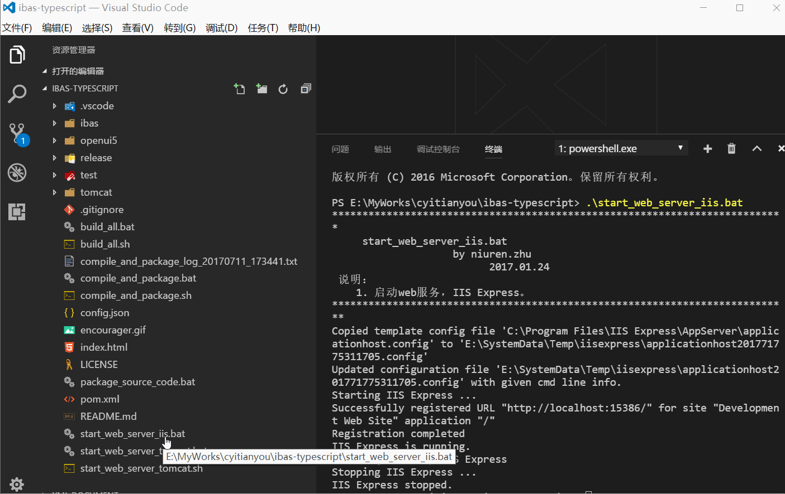

# Auto Run Script for Visual Studio Code
[此插件](https://github.com/cyitianyou/vscode-autorunscript)主要是为了解决项目中比较多的批处理文件的快速执行问题。

## 注意事项

* 1、目前插件只支持Windows版本 (Linux、MAC 也可用，未详细测试)
* 2、插件安装后,需要先指定本机Node.js安装路径,路径指定错误不检查,后续执行报错
     指定Node.js安装路径,使用配置项  autorunscript.nodePath
* 3、如使用Node环境,最好在系统环境变量Path中将 %APPDATA%\npm 加到最前面,这样脚本才会使用通过"npm install -g ********"安装的npm包

## 效果图

## 鸣谢 | Thanks
[民间盗号组织领导人](https://github.com/HackingGroup "一脸懵逼") 
[Color-Coding](https://github.com/color-coding "咔啦工作室") 
